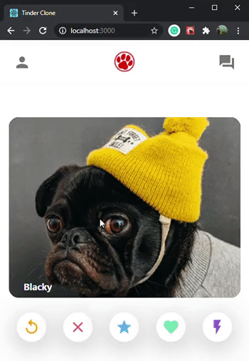

# MERN Tinder Clone

This project have source code of Tinder Clone

# About

This a Dog version Tinder Clone because why should hooman have all the fun :P
UI-wise this application give feel like tinder!

# Use

go to backend (BACKEND)

```bash
cd backend
npm install
```

edit server.js and put your mongoDB uri

```bash
npm start
```

go to tinder-clone-mern (FRONTEND)

```bash
npm install
npm start
```

# GIF


